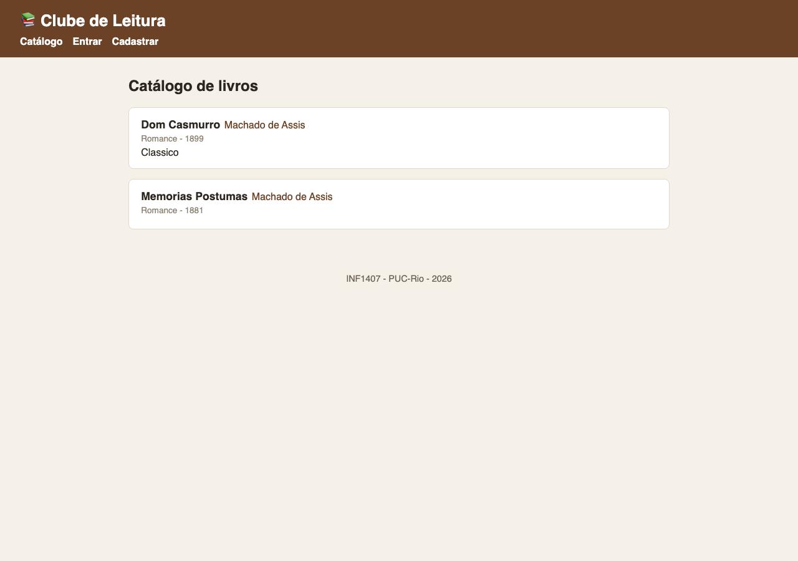
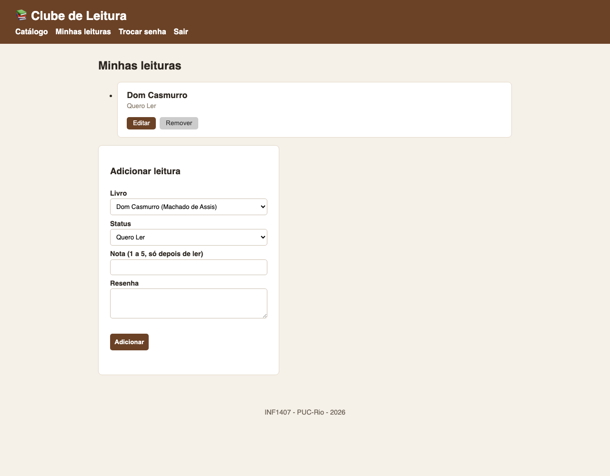
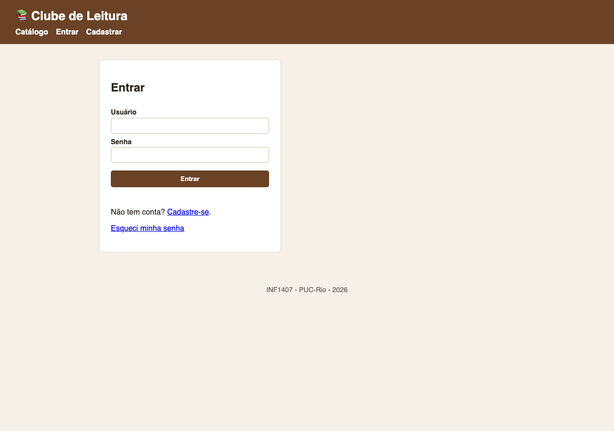
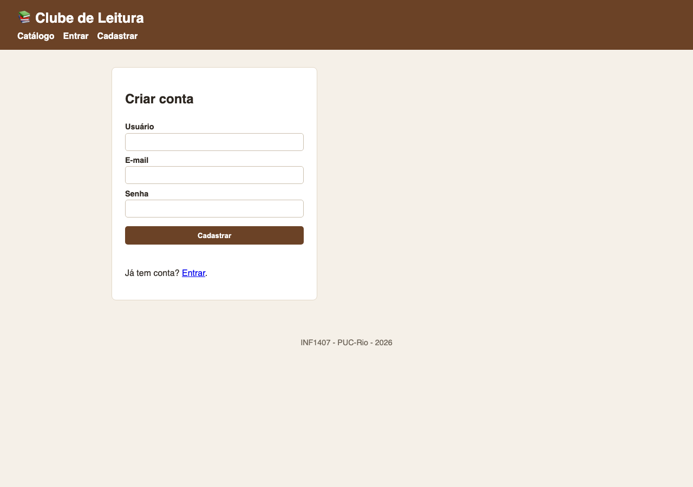

# Clube de Leitura - Frontend

Frontend do **Clube de Leitura**, trabalho 2 da disciplina INF1407 (Programação para
Web - PUC-Rio). É um site **estático** em HTML + CSS + **TypeScript** que consome a
API REST do backend (projeto separado) via `fetch`.

**Autor:** Guilherme Riechert Senko (matrícula 2011478)

- Repositório do backend: https://github.com/guilhermesenko/backend_t2

## Funcionalidades

- Catálogo de livros (público), carregado da API.
- Cadastro e login de usuário (JWT guardado no `localStorage`).
- Minhas leituras: o usuário adiciona, edita e remove suas próprias leituras
  (status, nota e resenha), com a regra de só dar nota depois de ler.
- Área de administrador (apenas `is_staff`): cadastro, edição e remoção de livros.
- Troca de senha e redefinição de senha por token.
- Menu de navegação que muda conforme o usuário esteja deslogado, logado ou seja admin.

## Estrutura

```
frontend_t2/
├── public/              # site estático (servido como está)
│   ├── index.html       # catálogo
│   ├── login.html / registrar.html
│   ├── minhasLeituras.html
│   ├── adminLivros.html
│   ├── trocarSenha.html / recuperarSenha.html
│   ├── css/estilo.css
│   ├── img/
│   └── javascript/      # SAÍDA do compilador TypeScript (gerada, não versionada)
├── typescript/          # código-fonte TypeScript
│   ├── constantes.ts    # endereço da API (backendAddress)
│   ├── auth.ts          # login, logout, tokens, fetch autenticado
│   ├── nav.ts           # menu por papel
│   ├── catalogo.ts / leituras.ts / adminLivros.ts
│   ├── login.ts / registro.ts / trocarSenha.ts / recuperarSenha.ts
│   └── tsconfig.json
├── package.json
└── Dockerfile           # nginx servindo o public/
```

Todo o JavaScript é gerado a partir do TypeScript em `typescript/`, compilado para
`public/javascript/`.

## Pré-requisitos

- Node.js (para compilar o TypeScript).
- O backend rodando (veja o repositório do backend). O endereço da API é configurado
  em `typescript/constantes.ts` (`backendAddress`).

## Como rodar localmente

```bash
npm install
npm run build        # compila uma vez
# ou
npm run watch        # recompila a cada alteração
```

Mude para a pasta `public/`:

```bash
cd public
python3 -m http.server 8080
```

Acesse `http://localhost:8080`.

## Rodando a imagem publicada no Docker Hub

A imagem do frontend está publicada em
[guilhermesenko/clubeleitura_frontend_t2](https://hub.docker.com/r/guilhermesenko/clubeleitura_frontend_t2).

```bash
docker pull guilhermesenko/clubeleitura_frontend_t2:latest
docker run -p 8080:80 guilhermesenko/clubeleitura_frontend_t2:latest
```

Acesse `http://localhost:8080`.

> **Importante:** o frontend consome a API em `http://localhost:8000/`
> (valor de `backendAddress` em `typescript/constantes.ts`). Portanto, para o site
> funcionar, o **backend precisa estar rodando em `http://localhost:8000/`**. Suba os
> dois containers (veja o README do backend) e abra `http://localhost:8080`.

### Aplicação completa (backend + frontend)

```bash
# backend
docker run --name clube_back -p 8000:8000 guilhermesenko/clubeleitura_backend_t2:latest
# frontend (em outro terminal)
docker run -p 8080:80 guilhermesenko/clubeleitura_frontend_t2:latest
```

Depois abra `http://localhost:8080`. Para usar a área de administrador, crie um
superusuário: `docker exec -it clube_back python manage.py createsuperuser`.

## Build local com Docker

A partir do código-fonte, o `Dockerfile` faz um build em duas etapas: compila o
TypeScript e serve os arquivos estáticos com nginx.

```bash
docker build -t clubeleitura_frontend_t2 .
docker run -p 8080:80 clubeleitura_frontend_t2
```

Acesse `http://localhost:8080`.

## Telas

Catálogo de livros (público):



Minhas leituras (usuário logado, com CRUD e menu por papel):



Tela de login:



Cadastro de usuário:



## O que funcionou e o que não funcionou

Tudo o que foi proposto foi testado e está funcionando:

- Catálogo carregado da API (visível para visitantes).
- Cadastro e login de usuário, com o token JWT guardado no `localStorage`.
- CRUD de leituras do próprio usuário (adicionar, editar e remover), incluindo a
  validação de só permitir nota depois de ler.
- Área de administrador (cadastro, edição e remoção de livros), visível apenas para
  usuários `is_staff`.
- Troca de senha e redefinição de senha por token.
- Menu de navegação diferente para visitante, usuário comum e administrador.

Não há funcionalidades com problemas conhecidos. O endereço do backend é configurado
em `typescript/constantes.ts`; para a redefinição de senha, o token é exibido no log
do backend (que usa backend de e-mail de console em desenvolvimento).
